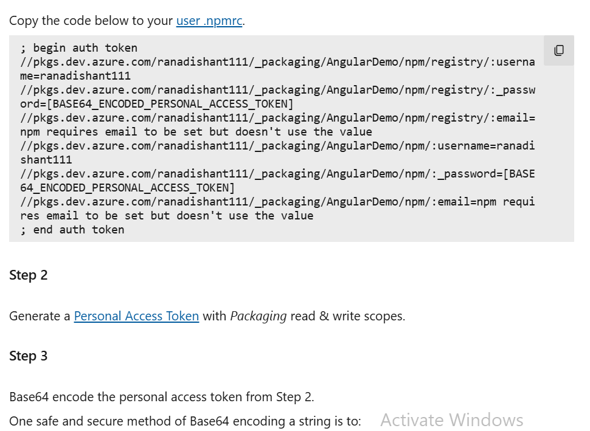
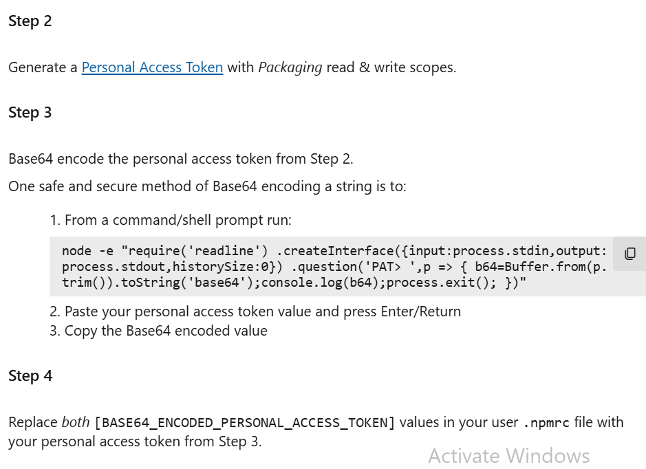

1. Create Work Space

```
npx create-nx-workspace --preset=apps --name=devLibSpace
```

2. go to work space

```
cd devLibSpace
```

3. Add angular

```
nx add @nx/angular
```

4. Create Library import path will be publishbale nmae of library

```
nx g @nx/angular:lib libs/auth --publishable --importPath=@manage/manage-auth
```

5. Generate .npmrc file
   herre registry is url of feed.

```
@manage:registry=https://pkgs.dev.azure.com/ranadishant111/_packaging/AngularDemo/npm/registry/
registry=https://registry.npmjs.org/

always-auth=true
```

6.  Create build
    nx build auth

7.  Go to dist folder
8.  Copy pase .npmrc file is not available
    note: preferable to use scoped .npmrc as we have used

9.  publish package
    before publish we have authentication with azure server.
    if using azure dev site then.

    ```
    npm -i -g vsts-npm-auth
    ```

    Then run following where .npmrc file is found

    ```
    vsts-npm-auth -config .npmrc
    ```

    This will ask you for authentication then let you publish package.

    else for private azure server
    
    
    Setup credentials

         Step 1
         Copy the code below to your user .npmrc.

            ```
            ; begin auth token
            //pkgs.dev.azure.com/ranadishant111/\_packaging/AngularDemo/npm/registry/:username=ranadishant111
            //pkgs.dev.azure.com/ranadishant111/\_packaging/AngularDemo/npm/registry/:\_password=[BASE64_ENCODED_PERSONAL_ACCESS_TOKEN]
            //pkgs.dev.azure.com/ranadishant111/\_packaging/AngularDemo/npm/registry/:email=npm requires email to be set but doesn't use the value
            //pkgs.dev.azure.com/ranadishant111/\_packaging/AngularDemo/npm/:username=ranadishant111
            //pkgs.dev.azure.com/ranadishant111/\_packaging/AngularDemo/npm/:\_password=[BASE64_ENCODED_PERSONAL_ACCESS_TOKEN]
            //pkgs.dev.azure.com/ranadishant111/\_packaging/AngularDemo/npm/:email=npm requires email to be set but doesn't use the value
            ; end auth token
            ```

            Step 2
            Generate a Personal Access Token with Packaging read & write scopes.

            Step 3
            Base64 encode the personal access token from Step 2.

            One safe and secure method of Base64 encoding a string is to:

            1. From a command/shell prompt run:
               node -e "require('readline') .createInterface({input:process.stdin,output:process.stdout,historySize:0}) .question('PAT> ',p => { b64=Buffer.from(p.trim()).toString('base64');console.log(b64);process.exit(); })"

            2. Paste your personal access token value and press Enter/Return
            3. Copy the Base64 encoded value
               Step 4
               Replace both [BASE64_ENCODED_PERSONAL_ACCESS_TOKEN] values in your user .npmrc file with your personal access token from Step 3.

```

npm publish

```

Note : npm publish will pick up registry from .npmrc file

10. Go to other porject wher you want to use published package.
    example in devremotea.

11. Now in devremotea where package json is there.
    add .npmrc file (same as other one)

12. do npm i package name install

13. import and use package
